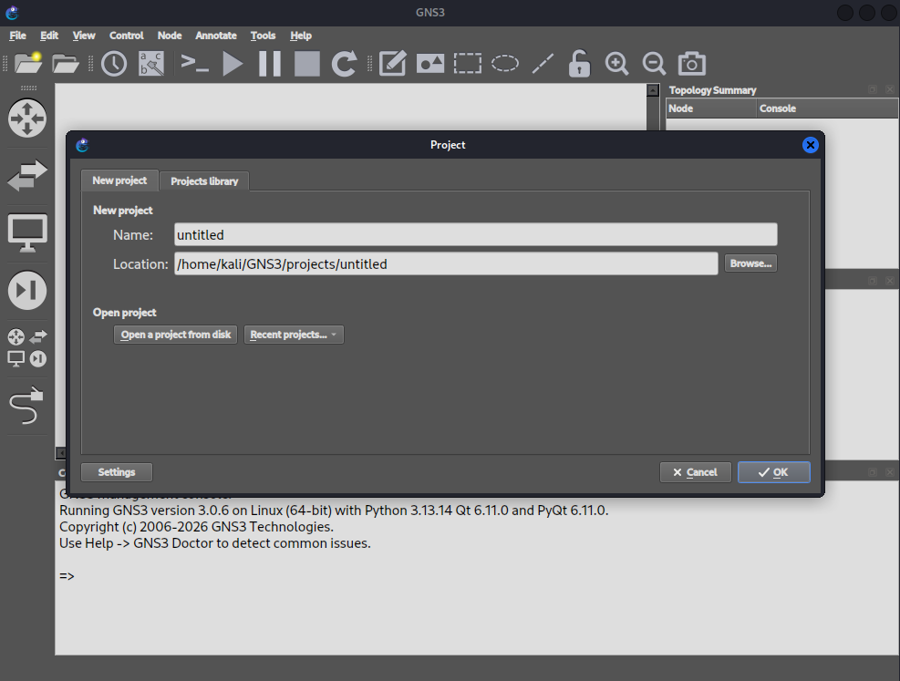
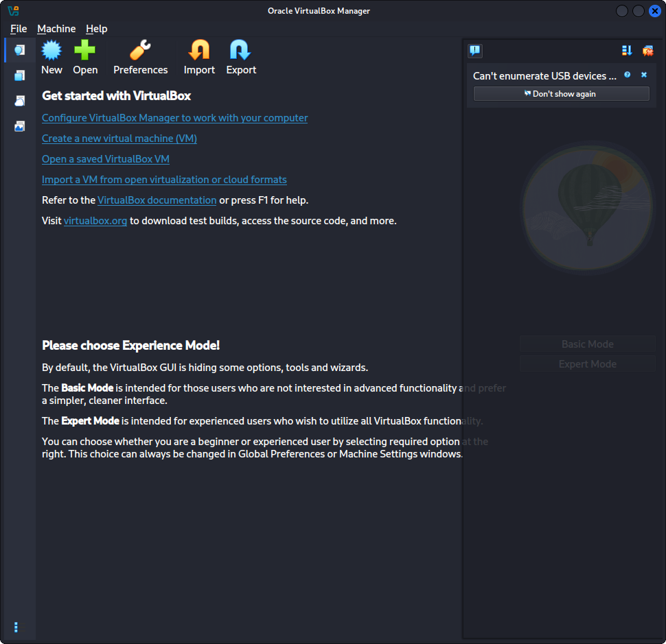
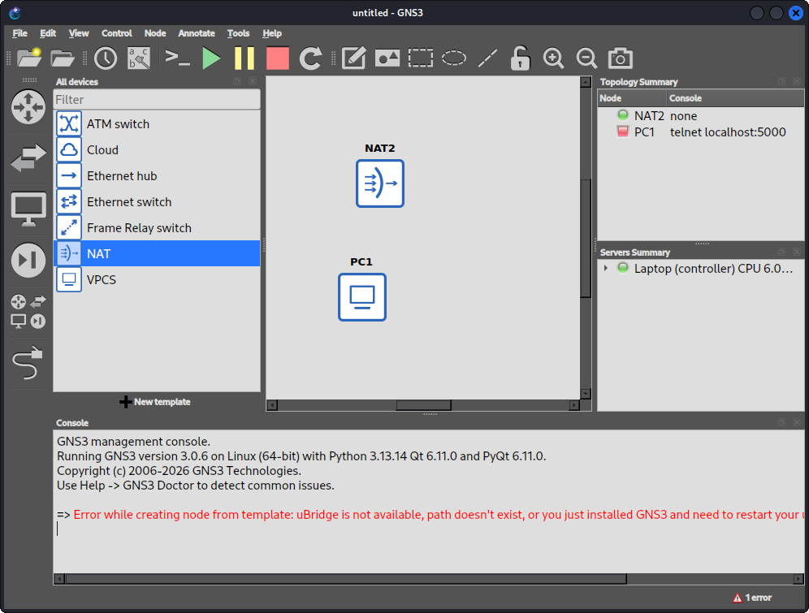
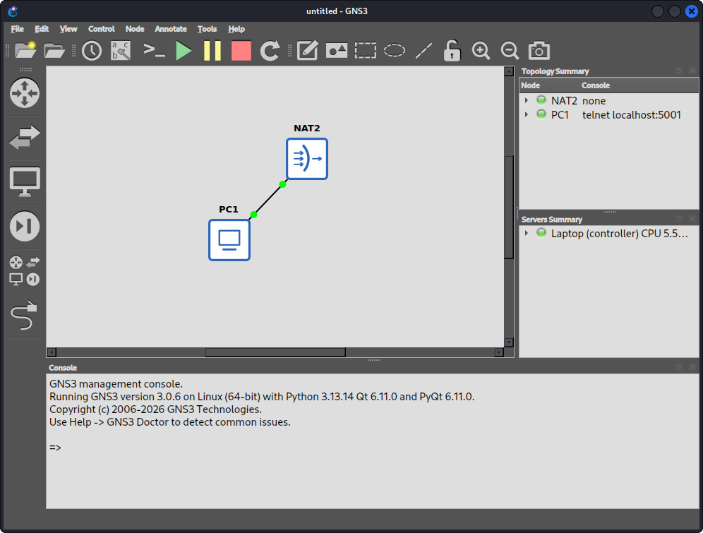
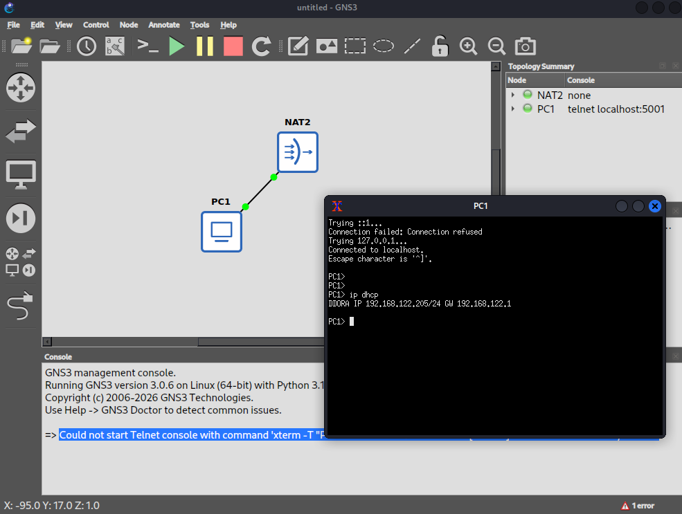
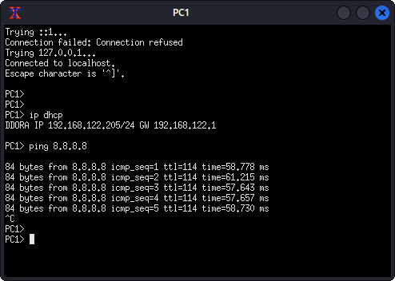

# 01 - Prep the Host (Kali)

## Goal

Before I can use GNS3, I must prepare my Kali host device by downloading all the dependencies and ISOs for VMs in GNS3. 
I'm using Kali Linux in particular because I've already had this OS installed in my device, and I don't plan to install another OS for this project.
Because Kali Linux is Debian-based, the steps to install GNS3 is different if you are running a different OS. 

## Objectives
 - Install GNS3 + local hypervisor (QEMU/VirtualBox). 
 - Download pfSense CE, Windows Server 2022 Eval, Windows 10 Eval ISOs. 
 - Confirm nested networking (loopback/NAT cloud) works.

## Steps

### Install GNS3

1. Install Dependencies
```sh
sudo apt update && sudo apt upgrade -y
sudo apt install python3 python3-pip pipx python3-pyqt6 python3-pyqt6.qtwebsockets \
    python3-pyqt6.qtsvg qemu-kvm qemu-utils libvirt-clients libvirt-daemon-system \
    virtinst ca-certificates curl gnupg2
```

2. Install GNS3 via pipx
```sh
pipx install gns3-server
pipx install gns3-gui
pipx inject gns3-gui gns3-server PyQt6
```
 
3. Dynamips (dropped from apt on Debian 13/Kali — build from source)
```sh
sudo apt install build-essential cmake libelf-dev libpcap0.8-dev
git clone https://github.com/GNS3/dynamips.git
cd dynamips && mkdir build && cd build && cmake .. && sudo make install
```
 
4. Launch (starts GUI + gns3server)
```sh
gns3
```



### Installing VirtualBox

1. Prep
```sh
sudo apt install virtualbox linux-headers-generic
sudo apt install virtualbox-ext-pack
```

2. Verify
```sh
virtualbox
```



### Download ISOs

1. Pfsense CE: https://www.pfsense.org/download/
2. Windows Sever 2022: https://software-download.microsoft.com/download/pr/20348.1.210507-1500.fe_release_SERVER_EVAL_x64FRE_en-us.iso
3. Windows 10 Eval: https://software-static.download.prss.microsoft.com/dbazure/988969d5-f34g-4e03-ac9d-1f9786c66750/19045.2006.220908-0225.22h2_release_svc_refresh_CLIENTENTERPRISEEVAL_OEMRET_x64FRE_en-us.iso

### Testing NAT Cloud

1. Drag the NAT from Browse All Devices

Then, I ran into this error and doesn't allow me to place the NAT:
```sh
Error while creating node from template: NAT interface virbr0 is missing, please install libvirt
```

* Fix: 

```sh
# Install libvirt, standard utilities, and firewalld dependencies
sudo apt install qemu-kvm libvirt-daemon-system libvirt-clients bridge-utils firewalld -y

# Start and enable the libvirt service
sudo systemctl enable --now libvirtd
sudo systemctl enable --now firewalld

# Define the default network if it doesn't exist
sudo virsh net-define /etc/libvirt/qemu/networks/default.xml 2>/dev/null

# Set the default network to start automatically on boot
sudo virsh net-autostart default

# Start the default network right now
sudo virsh net-start default

# Restart the daemon to sync changes
sudo systemctl restart libvirtd
```

Then, I received this other error:
```sh
Error while creating node from template: uBridge is not available, path doesn't exist, or you just installed GNS3 and need to restart your user session to refresh user permissions.

```

* Fix (according to https://www.sysnettechsolutions.com/en/install-gns3-kali-linux/#how-to-fix-the-ubridge-is-not-available-error-in-gns3-step-1)

```sh
sudo apt install libpcap-dev

git clone https://github.com/GNS3/ubridge.git
cd ubridge

make 

sudo make install
```
This successfully fixed the errors.


2. Drag the VPC (Virtual PC) from Browse All

VPC didn't start and gave me this error: 
```sh
error while starting PC1: No path to a VPCS executable has been set
```
* Fix:
```sh
sudo apt install vpcs
```
This allowed the VPC to get started. 

3. Create a link between VPC and NAT



4. Start a Console on VPC
Received this error:
```sh
Could not start Telnet console with command 'xterm -T "PC1" -e "telnet localhost 5001"': [Errno 2] No such file or directory: 'xterm'
```
* Fix
```sh
sudo apt install xterm
```
5. Get an IP via DHCP (NAT cloud runs a DHCP server by default)
```sh
ip dhcp
```


The addess I receieved was 192.168.122.x, which verifies that NAT cloud works!

6. Testing outbound connectivity

Successfully pinging 8.8.8.8


## Verification

## Issues & Fixes

## Resources
GNS3 Linux install: https://docs.gns3.com/docs/getting-started/installation/linux
VirtualBox for Kali: https://www.kali.org/docs/virtualization/install-virtualbox-host/
