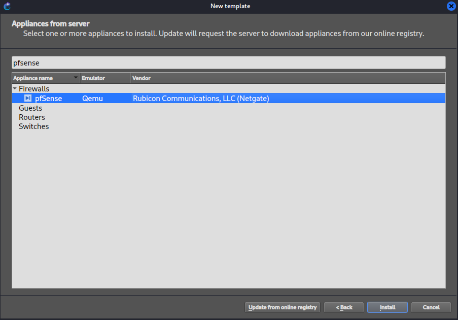
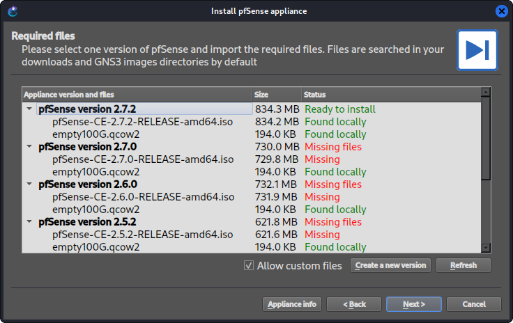
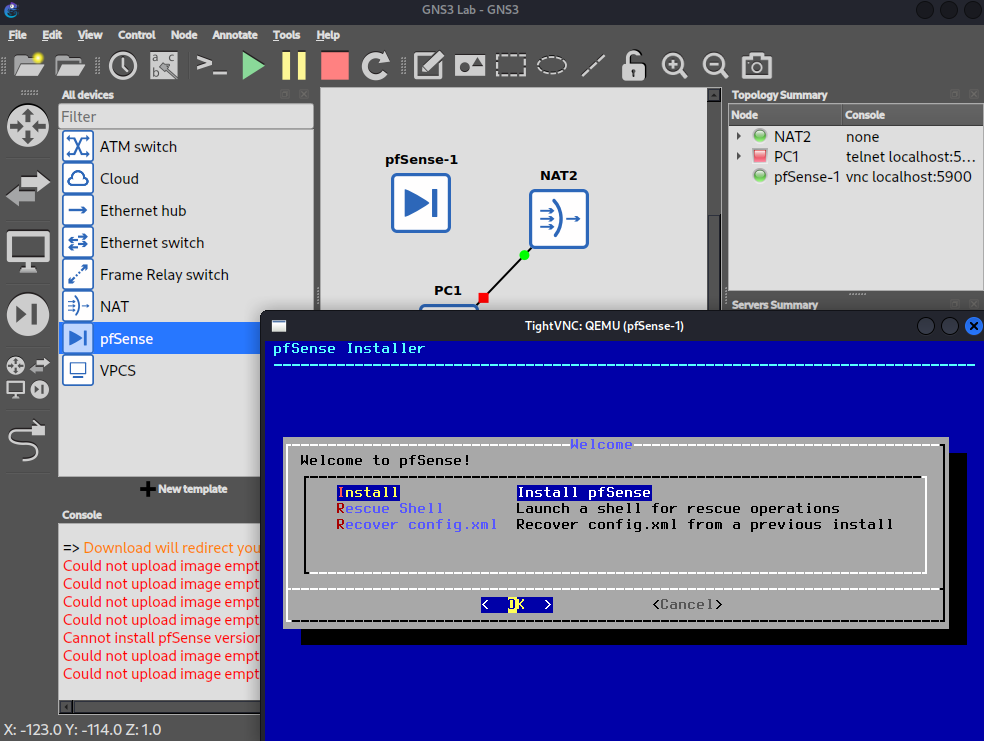

# 02 - Deploy GNS3 Appliances

## Goal

The goal of Objective #2 is to get every "building block" node into GNS3's local library so that from this point forward, building out the lab is just drag-and-drop — no more downloading, importing, or installing base OS images mid-lab.

pfSense will act as the firewall/router for the entire lab and allows us to make VLANs, NAT, firewall rules, IDS/IPS, and VPN.
A WebTerm node lets us get a CLI into the topology without booting a full VM just to run a ping or check a config, saving time and RAM.
Making a Windows Server & Windows 10 templates will be most resource- and time-expensive nodes in the whole lab. Getting them installed and stable once now means every later phase (AD DS, DHCP, DNS, file server, GPOs, client join) is just spinning up a clone of a known-good template instead of reinstalling Windows from scratch each time.
VirtIO/Guest tools is installed to speed up disk and network I/O.

## Objectives

- Import pfSense, a switch appliance, and a WebTerm node
- Build Windows Server and Windows 10 QEMU templates. 
- Install VirtIO/Guest tools for performance.

## Steps

### Import pfSense

pfSense already has a ready-made .gns3a appliance template so you don't hand-build it like the Windows VMs.

1. GNS3: **File → New template → Install an appliance from the GNS3 server** 

2. Search for 'pfSense' and install it

3. GNS3 shows you the required files for a given release — typically an ISO installer and an empty qcow2 disk (e.g., "empty100G.qcow2"). Click **Download** for each; it'll bounce you to Netgate's site and the GNS3 registry for the empty disk.

4. Once downloaded, click **Import** in GNS3 for each file — this uploads them into GNS3's local image store

I receieved this error: `Could not upload image empty100G.qcow2: Database error detected, please check logs to find details`

* Fix: Check the "Allow custom files"

5. Finish the wizard. pfSense now appears in your node list.

6. Drag it onto the canvas, start it, console in, and run through the pfSense install wizard using all default settings. 

* Used `Auto (UFS)` for partition and `MBR` partition scheme. The empty qcow2, shows up as `vtbd0`.
Default LAN port is `em1`. Default creds after setup: `admin` / `pfsense`.

### Adding Switch appliance

GNS3 ships with built-in Ethernet Switch nodes. Just drag one onto the canvas.
If you specifically want a managed switch with CLI (VLANs, trunking config via commands rather than GNS3's GUI-based port config), you'd instead deploy something like Cisco IOSvL2 or Open vSwitch.

### Added WebTerm node

1. In **New template → Install an appliance from the GNS3 server**, search "WebTerm".

### Build Windows Server 2022 QEMU template

1. Download the Windows Server 2022 Evaluation ISO from the Microsoft Evaluation Center

2. In GNS3: File → New template → Manually create a new template → QEMU VMs

3. Name it (e.g., "Windows Server 2022"), set the following configurations:
* RAM: 4096MB 
* vCPUs: 2
* Boot priority: HDD or CD/DVDROM
* Console type: vnc

* In the HDD tab, I chose to use `empty50G.qcow2` (qcow2 disk — 40–60GB is plenty for a lab DC/file server, and qcow2 is thin-provisioned so it won't eat that much actual disk space upfront.)
* On the CD/DVD tab, mount the Windows Server 2022 ISO

When I applied the changes, I received this error: `Image '/home/kali/GNS3/images/QEMU/SERVER_EVAL_x64FRE_en-us.iso' could not be found in the controller database`

* Fix: Go to **File → Image Management → Upload → choose the Windows Server ISO**

4. Finish the template, drag the node onto canvas, start it, and console in via VNC — GNS3 will pop a VNC viewer window 
* I chose to install the Windows Server 2022 Desktop Experience version
* Sending Ctrl+Alt+Del requires pressing F8 to pull up a menu

### Build Windows 10 QEMU template

Same process as Windows Server:
1. In GNS3: File → New template → Manually create a new template → QEMU VMs
2. Uploaded the ISO to Image management: **File → Image Management → Upload → choose the Windows Server ISO**
2. Name it (e.g., "Windows Server 2022"), set the following configurations:
* RAM: 4096MB 
* vCPUs: 2
* Boot priority: HDD or CD/DVDROM
* Console type: vnc
* In the HDD tab, I chose to use `empty50G.qcow2` 
* On the CD/DVD tab, mount the Windows 10 ISO 
3. Finish the template, drag the node onto canvas, start it, and console in via VNC — GNS3 will pop a VNC viewer window 

### Install VirtIO/Guest tools for performance

1. Download VirtIO driver ISO (virtio-win.iso): https://fedorapeople.org/groups/virt/virtio-win/direct-downloads/archive-virtio/virtio-win-0.1.285-1/

2. After the OS is installed, stop the node. Then, configure the node, and in CD/DVD tab, replace the existing ISO and mount virtio-win.iso as CD-ROM.

3. Start the Windows node, go to File Explorer and find the CD/DVD, where you will run the virtio-win-guest-tools.exe installer from inside Windows. This adds the balloon driver (dynamic memory), the network adapter driver if you switch the NIC model to virtio-net, and QXL display driver for smoother VNC console performance.

4. After the install, stop the node. Then, configure the node, and on the template's Network tab, set adapter type to virtio-net-pci once the driver's installed — noticeably better throughput than the default e1000 emulation

## Resources
VirtIO Drivers: https://fedorapeople.org/groups/virt/virtio-win/direct-downloads/archive-virtio/virtio-win-0.1.285-1/