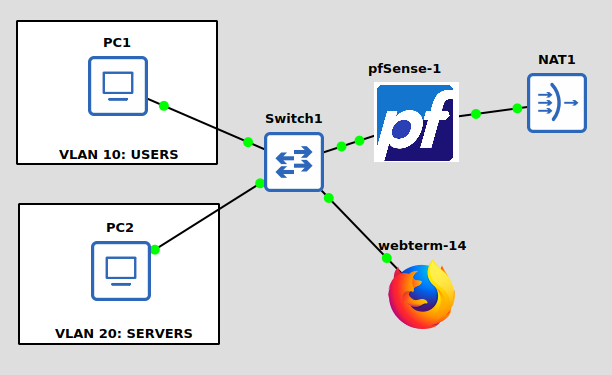

# 04 - VLAN Trunking on pfSense

## Goal

Before we begin, let's understand what VLAN is. 
Normally, one physical (or virtual) network interface = one broadcast domain — everything plugged into the same switch can see each other's broadcast traffic, and you'd need a separate physical cable/interface per network segment to keep them apart. That doesn't scale — you'd need dozens of NICs on pfSense for dozens of networks.
A VLAN (Virtual LAN) solves this by tagging Ethernet frames with a numeric ID so multiple logically separate networks can share the same physical link. A switch port or interface set to trunk mode carries multiple VLAN-tagged streams simultaneously; each device or sub-interface then only "sees" the traffic tagged for its specific VLAN ID, even though it's all riding the same wire.

Two pieces make this work:
* Trunk link — carries multiple tagged VLANs between pfSense and your switch
* Access port — a switch port that carries only one VLAN, untagged, for whatever end device (a client PC, a server) is plugged into it — the device itself has no idea VLANs exist

This is exactly what lets your one pfSense LAN interface eventually serve three separate networks (Users, Servers, Mgmt) instead of needing three physical NICs.

The goal of Objective #4 is to turn the single LAN interface (from Objective #3) into a trunk carrying three separate isolated networks — Users, Servers, and Management — each with its own subnet. This is the segmentation step that makes the rest of the lab actually resemble a real office network instead of one big flat broadcast domain.

## Objectives

- Assign LAN interface IP. 
- Enable WebGUI/console access. 
- Create trunk parent interface. 
- Create VLAN sub-interfaces (e.g., VLAN10-Users, VLAN20-Servers, VLAN99-Mgmt).

## Steps

Do the following in pfSense web interface with WebTerm.

### Designate the trunk parent interface

The existing LAN interface (em1) becomes the trunk parent — the physical/virtual interface that will carry all three tagged VLANs to the switch.

1. Go to pfSense GUI → Interfaces → Assignments
2. Note which interface is currently LAN (should be em1) — this is your trunk parent, you don't need to change anything here yet

### Create the VLAN sub-interfaces

1. **Interfaces → Assignments → VLANs tab**
2. Click Add
3. Repeat for each VLAN:

| Parent Interface | VLAN Tag | Description |
| em1 | 10 | Users |
| em1 | 20 | Servers |
| em1 | 99 | Mgmt |

For each row: select em1 as parent, enter the VLAN tag number, add the description, Save. After adding all three, Apply Changes.

### Assign each VLAN as a real interface

Now that pfSense knows these VLANs exist, they need to become actual interfaces you can configure IPs on:

1. Interfaces → Assignments
2. In the "available network ports" dropdown, you'll now see VLAN 10 on em1, VLAN 20 on em1, VLAN 99 on em1 — add each one
3. This creates OPT1, OPT2, OPT3. Then, rename them for clarity: click into each, change description to rename to USERS, SERVERS, MGMT

### Assign IPs to each VLAN interface

For each new interface (Interfaces → [name]):

| Interface | Static IP | Subnet |
| USERS (VLAN10) | 192.168.10.1 | /24 |
| SERVERS (VLAN20) | 192.168.20.1 | /24 | 
| MGMT (VLAN99) | 192.168.99.1 | /24 |

For each: check Enable interface, set IPv4 Configuration Type to Static, enter the IP/subnet above, Save → Apply Changes.

### Configure the trunk on the switch side (GNS3)

pfSense now sends tagged VLAN traffic out em1 — but your GNS3 switch node needs to know to pass those tags through rather than stripping them.

1. Right-click the switch node connected to pfSense's em1 → Configure
2. Find the port connected to pfSense (Port 0) → set it to trunk mode (Set type as dot1q) → Click `Add` to apply changes
3. For any ports going to end devices later (a client on VLAN10, a server on VLAN20), set those as Access ports tagged to the single VLAN that device belongs to.

### Enable DHCP on VLAN interfaces

With every creation of a VLAN interface, it doesn't automatically turn on a DHCP server for it, so we have to explicitly enable DHCP in pfSense.

1. Go to pfSense GUI → Services → DHCP Server
2. You'll see tabs for each interface — click the USERS tab 
3. Check Enable DHCP server on USERS interface
Set a range, e.g. 192.168.10.100 – 192.168.10.200
4. Click Save → Apply Changes
5. Also, do these steps with the SERVERS interface, but with the range 192.168.20.100 – 192.168.20.200. 

### Verify trunking works end-to-end

1. Attach a VPCS or WebTerm node to an access port on VLAN10 (Users) on the switch

 

2. Console in and enter `ip dhcp` 
3. ping 192.168.10.1 — confirms you're reaching the correct VLAN gateway on pfSense

When I tried to ping 192.168.10.1, it says 'timeout'.

The problem is due to pfSense having zero firewall rules by default. This makes ICMP (ping) to the interface's own gateway IP can get silently dropped by the default deny-all rule.
To fix this, we add a temporary permissive rule for the interface. 
Go to pfSense GUI → Firewall → Rules. Click the USERS tab. Click Add (either arrow)
Set:
* Action: Pass
* Interface: USERS
* Address Family: IPv4
* Protocol: Any
* Source: Any
* Destination: Any
Then, Save and Apply changes. 
And also do this for SERVERS interface.

This successfully fixes the problem. 

4. Repeat with a node on VLAN20 → should get 192.168.20.x and ping 192.168.20.1

5. Cross-VLAN test (expected to work for now): from the VLAN10 node, ping 192.168.20.1 — this should currently succeed since we haven't added restrictive firewall rules yet 

## Resources