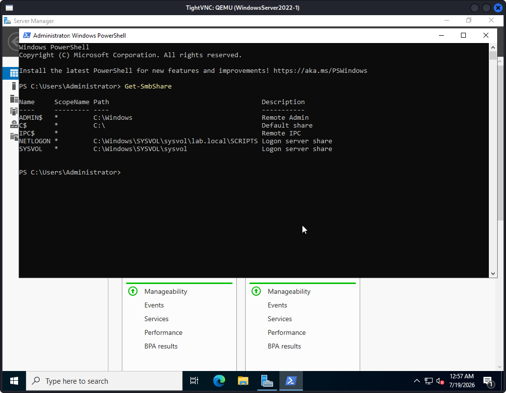
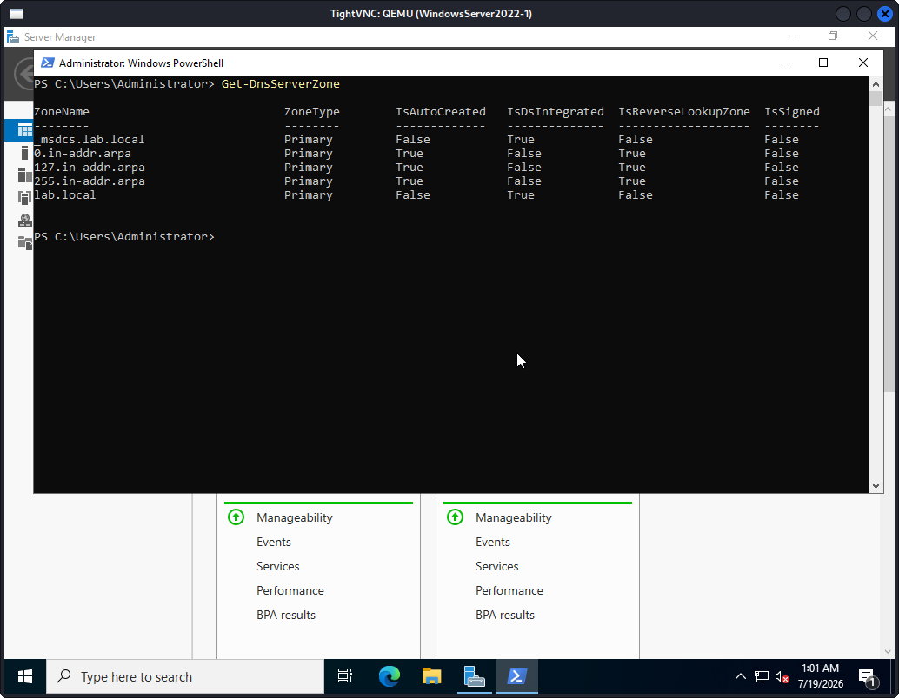

# 08 - Domain Controller (DC01)

## Goal

A Windows domain is a way to centrally manage a group of computers, users, and resources instead of configuring each machine individually. Instead of every PC having its own separate list of user accounts, its own separate password policy, its own separate settings — a domain puts one authority (the Domain Controller, DC01 in your lab) in charge of identity and policy for the whole network.
The specific technical goal: turn a plain Windows Server VM into the first Domain Controller in a brand-new AD forest, with a static identity on the network (fixed IP, since DHCP-changing IPs on a DC would break everything downstream), and verify the two concrete signs that promotion actually succeeded — the SYSVOL/NETLOGON shares (which store Group Policy and logon scripts, and every domain-joined machine depends on reaching them) and the auto-created DNS zone (AD is fundamentally DNS-dependent; without a working lab.local DNS zone, domain lookups fail everywhere).

## Objectives

- Deploy a Windows Server template
- Set a static IP address
- Install-ADDSForest (e.g. lab.local)
- Set DSRM (Directory Services Restore Mode) password
- Verify SYSVOL/NETLOGON shares and auto-created DNS zone post-promotion.

## Steps

### Deploy the VM

1. Drag your Windows Server 2022 template onto the canvas, name the node DC01
2. Connect it to your Access-1 switch, on the port assigned to VLAN20 (SERVERS)
3. Start it, console in (VNC)


### Set the static IP

Inside Windows:
1. Control Panel → Network and Sharing Center → Change adapter settings
2. Right-click the adapter → Properties → IPv4 → Properties
3. Set:
* IP address: 192.168.20.10
* Subnet mask: 255.255.255.0
* Default gateway: 192.168.20.1 (pfSense SERVERS interface)
* Preferred DNS server: 127.0.0.1 (itself — temporary, since it'll become the DNS server once AD DS is installed)


### Rename the computer 

In powershell (run as administrator), 
```sh
Rename-Computer -NewName "DC01" -Restart
```

### Install the AD DS role

Also in powershell:
```sh
Install-WindowsFeature -Name AD-Domain-Services -IncludeManagementTools
```

I then got this error:


The reason for this error is because I was running Windows PowerShell (x86). When I ran the command in the regular Windows PowerShell, it worked.


### Promote to the first DC in a new forest

A Windows Active Directory forest is the highest logical container in Microsoft's directory service. It consists of one or more AD domains that share a single schema, a common configuration, and a global catalog. Crucially, the forest acts as the ultimate security boundary for your network.

Also in powershell, make the forest:
```sh
Install-ADDSForest `
  -DomainName "lab.local" `
  -DomainNetbiosName "LAB" `
  -InstallDns:$true `
  -SafeModeAdministratorPassword (ConvertTo-SecureString "Admin1" -AsPlainText -Force)
```
After reboot, the login screen now expects a domain-qualified login:
`LAB\Administrator`
(same password as your original local Administrator — it carries over during promotion)


### Verify SYSVOL and NETLOGON shares exist

Run `Get-SmbShare` in PowerShell. You should see SYSVOL and NETLOGON listed alongside the default C$, ADMIN$, etc. 



### Verify the DNS zone auto-created

Run `Get-DnsServerZone`. You should see lab.local listed as a Primary zone, along with the standard _msdcs.lab.local forward lookup zone



Do some quick resolution tests:
```sh
nslookup lab.local
nslookup dc01.lab.local
```
Both should resolve to 192.168.20.10.


### Run a general health check

Run: `dcdiag /v`.
This runs a full battery of AD health tests — worth skimming for any failed test lines. On a fresh single-DC forest, everything should pass; if something's flagged, it's much easier to fix now than after you've built OUs and joined clients on top of a broken DC.

### Confirm from the network side
From a MGMT VPC test node:
```sh
ping 192.168.20.10
```


This should succeed, confirming DC01 is reachable through Core-SW/Access-1 and pfSense's routing as expected.

## Resources

Installing Windows AD: https://learn.microsoft.com/en-us/windows-server/identity/ad-ds/deploy/install-active-directory-domain-services--level-100-