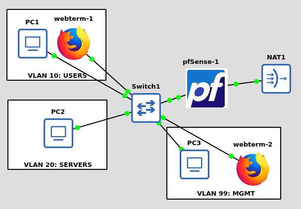

# Office & Domain Lab (GNS3)
A personal GNS3 home lab built for local hardware, designed for hands-on practice in networking, server, and security concepts. 
This plan mirrors the structure of [e-vakker/office-dc-lab](https://github.com/e-vakker/office-dc-lab), but scoped for local hardware instead of a cloud VM.
Everything is built in phases so you're never running more VMs at once than needed.
Additionally, this is an opportunity to gain experience with tools utilized by cybersecurity professionals.

## Software Stack
 
- **Kali Linux (bare metal)** — host OS running GNS3 directly
- **GNS3 GUI + gns3-server** - simulates the network & devices
- **pfSense CE** — firewall/router, VLAN trunking
- **Open vSwitch / GNS3 built-in switch nodes** — core & access switching
- **Windows Server 2022 Evaluation** (180-day, free from Microsoft) — DC, DHCP, DNS, file/print
- **Windows 10/11 Evaluation** — domain clients
- **WebTerm or a lightweight Linux appliance** — quick CLI access inside the topology

## Current Topology

## Objectives
 
| # | Topic | Objectives | Status |
|---|---|---|---|
| 1 | [Prep the Host](01_prep_host.md)| Install GNS3 + local hypervisor. Download pfSense, Windows Server, Windows 10 ISOs. Confirm NAT cloud works. | Completed |
| 2 | [Deploy GNS3 Appliances](02_deploy_gns3_apps.md) | Import pfSense, switch, WebTerm. Build Windows Server/10 QEMU templates. Install VirtIO tools. | Completed |
| 3 | [Install & Configure pfSense](03_install_configure_pfsense.md) | Add pfSense + NAT cloud. Setup wizard, assign WAN/LAN. | Completed |
| 4 | [VLAN Trunking on pfSense](04_vlan_trunking_pfsense.md) | Trunk parent + VLAN sub-interfaces (Users/Servers/Mgmt). | Completed |
| 5 | [Management VLAN](05_management_vlan.md) | Dedicated MGMT VLAN for admin access, separate from user traffic. | Completed |
| 6 | [Baseline Firewall Rules](06_baseline_firewall_rules.md) | Interface groups. Permissive rules to validate connectivity before locking down. | Completed |
| 7 | [Core & Access Switching](07_core_access_switching.md) | Core + access switches. Trunk vs access ports per VLAN. Disable unused ports. | Planned |
| 8 | [Domain Controller (DC01)](08_domain_controller.md) | Static IP on Servers VLAN. Install AD DS. Promote to first DC. | Planned |
| 9 | DHCP Server & Relay | DHCP role on DC01, authorize in AD. Scopes per VLAN. Relay on pfSense. | Planned |
| 10 | DNS Forwarding | Forwarders on DC01. Point clients at DC01 DNS only. | Planned |
| 11 | Organizational Units | Design and create OU structure for GPO targeting. | Planned |
| 12 | Join Clients & Create Users | Deploy Windows 10 client(s). Create users. Join to domain. | Planned |
| 13 | AD Security Groups | Role-based groups mapped to OUs. Add users. | Planned |
| 14 | Baseline GPOs | Password/lockout policy. Basic hardening GPO. Verify with gpresult. | Planned |
| 15 | Lightweight Server Appliance | Server Core template for future roles. | Planned |
| 16 | File Server (FS01) | Shares + NTFS permissions tied to AD groups. | Planned |
| 17 | Backup Server (BKUP01) | Backup job for FS01/DC01. Test restore, not just job status. | Planned |
| 18 | Second Domain Controller (DC02) | Deploy DC02, verify AD replication, note FSMO roles — removes DC01 single point of failure. | Planned |
| 19 | Certificate Authority (AD CS) | Install AD CS on DC01/dedicated node. Issue a domain-trusted cert for later use (WEB01, RADIUS, VPN). | Planned | 
| 20 | DMZ Setup | 4th NIC on pfSense, isolated DMZ interface. Narrow rules: DMZ → DB01 SQL port only. WAN port-forward. | Planned | 
| 21 | Web Server (WEB01) | Deploy in DMZ, NOT domain-joined. IIS + test site. Confirm no route to internal domain resources. | Planned | 
| 22 | Database Server (DB01) | Deploy on Servers VLAN, domain-joined. SQL Server Mixed Mode, dedicated local login scoped to one DB. | Planned | 
| 23 | WEB01 → DB01 Service Account & Connection | Encrypted connection string in IIS. Test SQL-login-only connection, confirm no other domain path. | Planned | 
| 24 | ACLs on Core Switches | VLAN-aware ACLs as a second enforcement layer behind pfSense. | Planned |
| 25 | Restrictive Firewall Rules | Replace permissive rules (#6) with least-privilege per VLAN. Verify DMZ isolation holds. | Planned |
| 26 | RADIUS / NPS | NPS on DC01 for centralized switch/pfSense admin login, tied to IT-Admins group. | Planned |
| 27 | Logging Server | Linux syslog target. Forward pfSense/switch logs. | Planned |
| 28 | Monitoring | Zabbix/Nagios for uptime/health. Test at least one real alert. | Planned |
| 29 | Software Deployment & Drive Mapping GPOs | GPP drive maps by group. Basic software deployment GPO. | Planned |
| 30 | IDS/IPS | Suricata on pfSense, focused on DMZ interface. Trigger and review a test alert. | Planned |
| 31 | Site-to-Site VPN / Branch Office | Second pfSense instance, IPsec/WireGuard tunnel to HQ. | Planned |
| 32 | Failover Test | Kill a node deliberately, document recovery time and lessons learned. | Planned |
| 33 | Linux Deployment | Debian/Ubuntu node, static IP, joins Mgmt VLAN. | Planned |
| 34 | Linux User & Access Management | Non-root users, sudo, SSH key auth, disable root/password SSH login. | Planned |
| 35 | Linux Hardening | UFW/nftables, fail2ban, auditd, unattended-upgrades. | Planned |

## Resources & References
 
- GNS3 Docs: https://docs.gns3.com/
- Microsoft Learn (AD/Windows Server): https://learn.microsoft.com/en-us/windows-server/
- pfSense Docs: https://docs.netgate.com/pfsense/en/latest/
- Windows Server Evaluation ISOs: https://www.microsoft.com/en-us/evalcenter/

