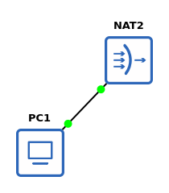

# Office & Domain Lab (GNS3)
A personal GNS3 home lab built for local hardware, designed for hands-on practice in networking, server, and security concepts. 
This plan mirrors the structure of [e-vakker/office-dc-lab](https://github.com/e-vakker/office-dc-lab), but scoped for local hardware instead of a cloud VM.
Everything is built in phases so you're never running more VMs at once than needed.

## Software Stack
 
- **Kali Linux (bare metal)** — host OS running GNS3 directly
- **GNS3 GUI + gns3-server** - simulates the network & devices
- **pfSense CE** — firewall/router, VLAN trunking
- **Open vSwitch / GNS3 built-in switch nodes** — core & access switching
- **Windows Server 2022 Evaluation** (180-day, free from Microsoft) — DC, DHCP, DNS, file/print
- **Windows 10/11 Evaluation** — domain clients
- **WebTerm or a lightweight Linux appliance** — quick CLI access inside the topology

## Current Topology

## Objectives
 
| # | Topic | Objectives | Status |
|---|---|---|---|
| 1 | [Prep the Host](01_prep_host.md)| Install GNS3 + local hypervisor (QEMU/VirtualBox). Download pfSense CE, Windows Server 2022 Eval, Windows 10 Eval ISOs. Confirm nested networking (loopback/NAT cloud) works. | Planned |
| 2 | Deploy GNS3 Appliances | Import pfSense, a switch appliance, and a WebTerm node. Build Windows Server and Windows 10 QEMU templates. Install VirtIO/Guest tools for performance. | Planned |
| 3 | Install & Configure pfSense | Add pfSense + NAT cloud to canvas. Complete initial setup wizard, assign WAN/LAN. | Planned |
| 4 | VLAN Trunking on pfSense | Assign LAN interface IP. Enable WebGUI/console access. Create trunk parent interface. Create VLAN sub-interfaces (e.g., VLAN10-Users, VLAN20-Servers, VLAN99-Mgmt). | Planned |
| 5 | Management VLAN | Stand up a dedicated MGMT VLAN for switch/firewall admin access, separate from user traffic. | Planned |
| 6 | Baseline Firewall Rules | Create interface groups. Add permissive rules to validate connectivity end-to-end before locking down later. | Planned |
| 7 | Core & Access Switching | Deploy core + access switch nodes. Configure trunk vs access ports per VLAN. Interconnect switches. Disable unused mgmt interfaces. | Planned |
| 8 | Domain Controller (DC01) | Rename server, assign static IP on Servers VLAN. Install AD DS. Promote to first DC in a new forest. | Planned |
| 9 | DHCP Server & Relay | Install DHCP role on DC01. Create scopes per VLAN. Configure DHCP relay/IP helper on pfSense so clients across VLANs get leases. | Planned |
| 10 | DNS Forwarding | Configure forwarders on DC01's DNS for external resolution. Point client DNS settings at DC01. | Planned |
| 11 | Organizational Units | Design and create an OU structure (e.g., by department or by device type) to support GPO targeting later. | Planned |
| 12 | Join Clients & Create Users | Deploy Windows 10 client(s). Create user accounts. Join clients to the domain. | Planned |
| 13 | AD Security Groups | Create security groups mapped to OUs/roles. Add users to groups. | Planned |
| 14 | Baseline GPOs | Configure password/lockout policy. Apply a basic optimization/hardening GPO. | Planned |
| 15 | Lightweight Server Appliance | Build a Server Core template (lower RAM footprint) for future roles instead of full Desktop Experience. | Planned |
| 16 | File Server (FS01) | Deploy FS01, create shares, apply NTFS + share permissions tied to AD groups. | Planned |
| 17 | Backup Server (BKUP01) | Stand up a basic backup target/job (Windows Server Backup or a lightweight solution) for FS01/DC01. | Planned |
| 18 | ACLs on Core Switches | Apply VLAN-aware ACLs to restrict inter-VLAN traffic beyond firewall rules. | Planned |
| 19 | Restrictive Firewall Rules | Replace the permissive rule set from #6 with least-privilege rules per VLAN. | Planned |
| 20 | RADIUS / NPS | Deploy NPS for centralized auth (e.g., switch/WiFi mgmt login via RADIUS). | Planned |
| 21 | Logging Server | Stand up a syslog target (e.g., a lightweight Linux node) and forward firewall/switch logs to it. | Planned |
| 22 | Monitoring | Deploy a lightweight monitoring tool (e.g., Zabbix/PRTG free tier/Nagios core) for uptime/health checks. | Planned |
| 23 | Software Deployment & Drive Mapping GPOs | Configure GPOs for mapped drives and basic software deployment. | Planned |
| 24 | IDS/IPS | Deploy Suricata/Snort (as a GNS3 appliance or on pfSense via package) to monitor/alert on traffic. | Planned |
| 25 | Site-to-Site VPN / Branch Office | Add a second pfSense instance representing a branch site; build an IPsec/WireGuard tunnel back to HQ. | Planned |
| 26 | Failover Test | Document a deliberate failure (e.g., kill core switch or DC) and record recovery behavior/lessons learned. | Planned |

## Resources & References
 
- GNS3 Docs: https://docs.gns3.com/
- Microsoft Learn (AD/Windows Server): https://learn.microsoft.com/en-us/windows-server/
- pfSense Docs: https://docs.netgate.com/pfsense/en/latest/
- Windows Server Evaluation ISOs: https://www.microsoft.com/en-us/evalcenter/

